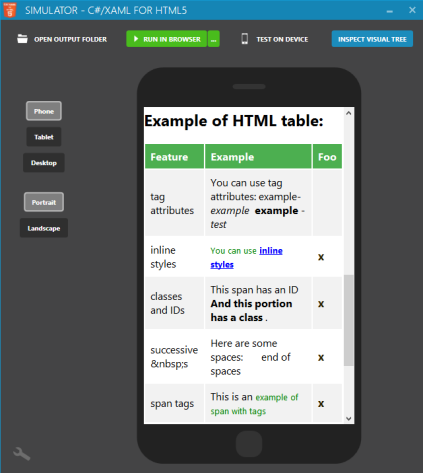
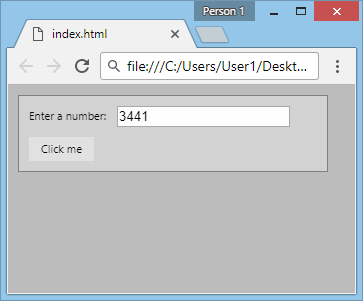

# How to use the HtmlPresenter to put HTML/CSS in your XAML
## Introduction
The HtmlPresenter control lets you easily embed custom HTML/CSS code inside your XAML, or create new custom controls using HTML code. The HTML code is inserted "as is" in the page. The CSS code is automatically merged to the page Header.


## Properties Reference
* *HTML:* You can use the HtmlPresenter control both in XAML and in C#, by setting the ".Html" property:

- If you use it in C#, just set the ".Html" property, like this:
`  HtmlPresenter1.Html = "<p>This is native HTML code</p>";`

- If you use it in XAML, just type the HTML code inside the HtmlPresenter tag, as shown in this example:
```
    <native:HtmlPresenter xmlns:native="using:CSHTML5.Native.Html.Controls">
        <p>This is native HTML code</p>
    </native:HtmlPresenter>
```

Refer to the ["Example 1"](#example-1-putting-html-code-inside-xaml) below for a more complete example.

* *DOMELEMENT:* You can call the *".DomElement"* property to get a reference to the root of the instantiated element in the DOM tree.

This can be useful for example to pass it to the method Interop.ExecuteJavaScript in order to manipulate it. Another common scenario is to pass the DOM element reference to a 3rd party library in order to have it render. It can be useful for example when importing TypeScript Definitions.

Note: the control must be loaded in the Visual Tree for this property to return a non-null result. To ensure that this control is loaded in the Visual Tree, you can read the property "IsLoaded", or you can place your code in the "Loaded" event handler of the control.

See the ["Example 2"](#example-2-creating-a-numerictextbox-control-with-input-typenumber) below for an example of how to interact with the DOM element.


## Example 1: Putting HTML code inside XAML

1. Create a new project of type OpenSilver - Empty Application. Let's name it "Application1".

2. Replace the content of MainPage.xaml with the following code:
```
<Page
    x:Class="Application1.MainPage"
    xmlns="http://schemas.microsoft.com/winfx/2006/xaml/presentation"
    xmlns:x="http://schemas.microsoft.com/winfx/2006/xaml">

    <ScrollViewer Background="White" VerticalScrollBarVisibility="Auto" HorizontalScrollBarVisibility="Auto">

        <native:HtmlPresenter xmlns:native="using:CSHTML5.Native.Html.Controls">

            <style type='text/css'>
                .sampleTable table {
                    border-collapse: collapse;
                    width: 100%;
                    background-color: #ffffff
                }

                .sampleTable th, .sampleTable td {
                    text-align: left;
                    padding: 8px;
                }

                .sampleTable tr:nth-child(even){background-color: #f2f2f2}

                .sampleTable th {
                    background-color: #4CAF50;
                    color: white;
                }
            </style>

            <h1>HTML Example</h1>
            <p>This is an example of formatted text:&#160;
                <strong>Pellentesque habitant morbi tristique</strong> senectus et
                <em>aenean ultricies mi vitae est</em> netus et
                <code>commodo vitae</code> , malesuada fames ac turpis egestas.
                <a href="#">Donec non enim</a> in turpis pulvinar facilisis. Ut felis.
            </p>
            <h2>This is header Level 2</h2>
            <ol>
                <li>This is an item in an ordered list</li>
                <li>This is another item in an ordered list</li>
            </ol>
            <blockquote>
                <p>This is a blockquote: Lorem ipsum dolor sit amet, consectetur adipiscing elit. Vivamus magna. Cras in mi at felis aliquet congue. Ut a est eget ligula molestie gravida.</p>
            </blockquote>
            <h3>This is header Level 3</h3>
            <ul>
                <li>This is an item in an unordered list</li>
                <li>This is another item in an unordered list</li>
            </ul>
            <h2>Example of HTML form:</h2>
            <form action="#" method="post">
                <div>
                    <label for="name">Text Input:</label>
                    <input id="name" tabindex="1" name="name" type="text" value="" />
                </div>
                <div>
                    <p>Radio Button Choice:&#160;
                        <label for="radio-choice-1">Choice 1</label>
                        <input id="radio-choice-1" tabindex="2" name="radio-choice-1" type="radio" value="choice-1" />
                        <label for="radio-choice-2">Choice 2</label>
                        <input id="radio-choice-2" tabindex="3" name="radio-choice-2" type="radio" value="choice-2" />
                    </p>
                </div>
                <div>
                    <label for="select-choice">Select Dropdown Choice:</label>
                    <select id="select-choice" name="select-choice">
                        <option value="Choice 1">Choice 1</option>
                        <option value="Choice 2">Choice 2</option>
                        <option value="Choice 3">Choice 3</option>
                    </select> &#160;
                </div>
                <div>
                    <label for="checkbox">Checkbox:</label>
                    <input id="checkbox" name="checkbox" type="checkbox" />
                </div>
            </form>
            <h2>Example of HTML table:</h2>
            <table class="sampleTable">
                <tr>
                    <th>Feature</th>
                    <th>Example</th>
                    <th>Foo</th>
                </tr>
                <tr>
                    <td>tag attributes</td>
                    <td>You can use tag attributes: example-
                        <em>example&#160;</em>
                        <strong>example</strong> -
                        <em>test</em>
                    </td>
                    <td>&#160;</td>
                </tr>
                <tr>
                    <td>inline styles</td>
                    <td>
                        <span style="color: green; font-size: 13px;">You can use
                            <strong style="color: blue; text-decoration: underline;">inline styles</strong>
                        </span>
                    </td>
                    <td>
                        <strong style="font-size: 17px; color: #2b2301;">x</strong>
                    </td>
                </tr>
                <tr>
                    <td>classes and IDs</td>
                    <td>
                        <span id="demoId">This span has an ID
                            <strong class="demoClass">And this portion has a class</strong> .
                        </span>
                    </td>
                    <td>
                        <strong style="font-size: 17px; color: #2b2301;">x</strong>
                    </td>
                </tr>
                <tr>
                    <td>successive &amp;#160;s</td>
                    <td>Here are some spaces:&#160;&#160;&#160;&#160;&#160;&#160;&#160;end of spaces</td>
                    <td>
                        <strong style="font-size: 17px; color: #2b2301;">x</strong>
                    </td>
                </tr>
                <tr>
                    <td>span tags</td>
                    <td>This is an
                        <span style="color: green; font-size: 13px;">example of span with tags</span>
                    </td>
                    <td>
                        <strong style="font-size: 17px; color: #2b2301;">x</strong>
                    </td>
                </tr>
                <tr>
                    <td>links</td>
                    <td>
                        <a href="http://www.cshtml5.com">This is</a> an example of link.
                    </td>
                    <td>&#160;</td>
                </tr>
                <tr>
                    <td>comments</td>
                    <td>After this text there is a comment that is only visible by looking at the source
                        <!-- This is a comment! -->
                    </td>
                    <td>
                        <strong style="font-size: 17px; color: #2b2301;">x</strong>
                    </td>
                </tr>
                <tr>
                    <td>Encoding special characters</td>
                    <td>
                        <span style="color: red; font-size: 17px;">&#9829;</span>
                        <strong style="font-size: 20px;">? ?</strong> &gt;&lt;
                    </td>
                    <td>
                        <strong style="font-size: 17px; color: #2b2301;">x</strong>
                    </td>
                </tr>
            </table>

        </native:HtmlPresenter>

    </ScrollViewer>

</Page>
```
3. Start the project with the .Simulator suffix to see the result.


Here is a screenshot of the result:
</br>



## Example 2: Creating a NumericTextBox control with &lt;input type='number'&gt;

1. Create a new project of type OpenSilver -> Empty Application. Let's name it "Application1".

2. Add a new class named "NumericTextBox", and copy/paste the following code:
```
using CSHTML5;
using CSHTML5.Native.Html.Controls;
using System;
using System.Windows;

namespace TestNumericTextBox
{
    public class NumericTextBox : HtmlPresenter
    {
        private int _value = 0;

        public NumericTextBox()
        {
            this.Html = @"<input type=""number"" pattern=""[0-9]*"">";

            this.Loaded += NumericTextBox_Loaded;
        }

        public int Value
        {
            get
            {
                if (this.DomElement != null) //Note: the DOM element is null if the control has not been added to the visual tree yet.
                {
                    int valueInt;
                    string valueString = Interop.ExecuteJavaScript("$0.value", this.DomElement).ToString();
                    if (Int32.TryParse(valueString, out valueInt))
                    {
                        _value = valueInt;
                    }
                }
                return _value;
            }
            set
            {
                _value = value;

                if (this.DomElement != null) //Note: the DOM element is null if the control has not been added to the visual tree yet.
                    Interop.ExecuteJavaScript("$0.value = $1", this.DomElement, _value);
            }
        }

        void NumericTextBox_Loaded(object sender, RoutedEventArgs e)
        {
            // Here, the control has been added to the visual tree, so the DOM element exists. We set the initial value:
            Interop.ExecuteJavaScript("$0.value = $1", this.DomElement, _value);
        }
    }
}
```

3. You can test the NumericTextBox control by using it in your XAML. Be sure to specify the correct namespace. Here is an example in the "MainPage.xaml" file:
```
<Page
    x:Class="Application1.MainPage"
    xmlns="http://schemas.microsoft.com/winfx/2006/xaml/presentation"
    xmlns:x="http://schemas.microsoft.com/winfx/2006/xaml"
    xmlns:controlns="using:TestNumericTextBox">
    <Border Margin="10" Padding="10" BorderThickness="1" BorderBrush="Gray" Background="LightGray" HorizontalAlignment="Left" VerticalAlignment="Top">
        <StackPanel>
            <StackPanel Orientation="Horizontal" HorizontalAlignment="Left">
                <TextBlock Text="Enter a number:" VerticalAlignment="Center"/>
                <controlns:NumericTextBox x:Name="NumericTextBox1" Value="100" Margin="10,0,0,0" Width="200" VerticalAlignment="Center"/>
            </StackPanel>
            <Button Content="Click me" Click="Button_Click" Margin="0,10,0,0" HorizontalAlignment="Left"/>
        </StackPanel>
    </Border>
</Page>
```

And this is the corresponding code-behind ("MainPage.xaml.cs"):
```
using System.Windows;
using Windows.UI.Xaml;
using Windows.UI.Xaml.Controls;

namespace Application1
{
    public partial class MainPage : Page
    {
        public MainPage()
        {
            this.InitializeComponent();

            // Enter construction logic here...
        }

        private void Button_Click(object sender, RoutedEventArgs e)
        {
            MessageBox.Show("The value is: " + NumericTextBox1.Value.ToString());
        }
    }
}
```

Here is a screenshot of the result:
</br>



## See Also
* [How to use the HtmlCanvas control](html-canvas.md)

* [How to call JavaScript from C#](call-javascript-from-csharp.md)

* [Importing TypeScript Definitions](importing-typescript-definitions.md)

## Contact Us
Please [click here](https://opensilver.net/contact.aspx) for contact information.
