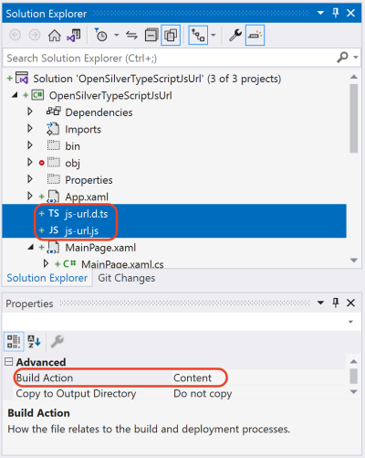

# Importing TypeScript Definitions

NOTE: starting from OpenSilver 3.0 you'll need to install [OpenSilver.TypeScriptDefinitionsToCSharp](https://www.nuget.org/packages/OpenSilver.TypeScriptDefinitionsToCSharp) package.

## Introduction
This feature lets you import and use thousands of JavaScript libraries as if they were written in C#.

Any JavaScript library that comes with a "TypeScript Definition" file can now be used from within a C#/XAML project without writing JavaScript code.

"TypeScript Definition" files are files that have the ".d.ts" extension. Their purpose is to provide strong typing (aka "type safety") to existing JavaScript libraries.

A repository of "TypeScript Definition" files for popular libraries can be found at: https://github.com/DefinitelyTyped/DefinitelyTyped


## Understanding what a "TypeScript Definition" file is
Let's consider for example the JavaScript library ["js-url" by Rob Nova](https://github.com/websanova/js-url).

Its goal is to let JavaScript developers easily parse URLs by providing several handy functions.

The library comes in the form of a JS file named "url.js" that looks like this:

(note: what you see below is only a small extract of the much larger original library)
```
// JavaScript library js-url 2.5.0 (extract)

(function() {
    var url = (function() {

        /*
        Some utility functions here
        */

        return function(arg, url) {
            var _l = {}, tmp, tmp2;

            /*
            The magic of parsing URL
            */

            // Return arg.
            if (arg in _l) { return _l[arg]; }

            // Return everything.
            if (arg === '{}') { return _l; }

            // Default to undefined for no match.
            return undefined;
        };
    })();

    window.url = url;
})();
```
By looking at the code above, you can see that the JavaScript library creates a function named "url" that parses URLs.

As you can see in the code above, the object is not strongly typed, meaning that the compiler has no way to know how to call this library.

It is possible to use the above library directly "as is", but you will get no intellisense, and no compile-time errors in case of mistakes. Furthermore, if you want to use the above library from your C# code in your OpenSilver project, you will need to make a lot of calls to ["Interop.ExecuteJavaScript(...)"](call-javascript-from-csharp.md) because no C# objects exist.

However, if the library comes with a "TypeScript Definition" file, or if you can create one, those issues are solved. In fact, the "TypeScript Definition" file will add strong-typing to the library, making it possible to have intellisense, compile-time error checking, and even direct calls to the library from C# thanks to the OpenSilver processing explained below.

The "TypeScript Definition" file for the library mentioned above does exist, it is named "js-url.d.ts", and it can be downloaded from: https://github.com/DefinitelyTyped/DefinitelyTyped/blob/17956ab1d255c6e739a2eed81f92e76bc60665b0/types/js-url/index.d.ts

This is what it looks like:
```
// Type definitions for url v1.8.6
// Project: https://github.com/websanova/js-url
// Definitions by: Pine Mizune <https://github.com/pine>
// Definitions: https://github.com/DefinitelyTyped/DefinitelyTyped

interface UrlStatic {
  (): string;
  (pattern: string): string;
  (pattern: number): string;
  (pattern: string, url: string): string;
  (pattern: number, url: string): string;
}

declare var url: UrlStatic;
```
By looking at the code above, you can see that the "TypeScript Definition" file tells the compiler that the "url" is a function, and it can be invoked with different parameters, and the function returns a string.


## How can I use a TypeScript Definition file in my OpenSilver project?

Simply add the TypeScript Definition file to your OpenSilver project, set "Build Action" to "Content" for the file, and the compiler will automatically take it into account.

 Usually you want to add both:

* the original JavaScript library (for example "js-url.js")
* AND the corresponding TypeScript Definition file (for example "js-url.d.ts")


## Sample project
Let's create a sample project to demonstrate the use of the "js-url.js" and "js-url.d.ts" files, as explained above.

This is what the sample project looks like:
<br>



This is the content of MainPage.xaml:
```
<sdk:Page
    x:Class="OpenSilverTypeScriptJsUrl.MainPage"
    xmlns="http://schemas.microsoft.com/winfx/2006/xaml/presentation"
    xmlns:x="http://schemas.microsoft.com/winfx/2006/xaml"
    xmlns:sdk="http://schemas.microsoft.com/winfx/2006/xaml/presentation/sdk"
    xmlns:d="http://schemas.microsoft.com/expression/blend/2008"
    xmlns:mc="http://schemas.openxmlformats.org/markup-compatibility/2006"
    mc:Ignorable="d">
    <Canvas>
        <Button Canvas.Left="20" Canvas.Top="30" Click="Button_Click">
            Click Me To Know Hostname
        </Button>
    </Canvas>
</sdk:Page>
```
And this is the content of MainPage.xaml.cs:
```
using System.Windows;
using System.Windows.Controls;
using OpenSilver;

namespace OpenSilverTypeScriptJsUrl
{
    public partial class MainPage : Page
    {
        public MainPage()
        {
            this.InitializeComponent();

            // Enter construction logic here...
            this.Loaded += MainPage_Loaded;
        }
        async void MainPage_Loaded(object sender, RoutedEventArgs e)
        {
            // Load the JavaScript library:
            await Interop.LoadJavaScriptFile("ms-appx:///OpenSilverTypeScriptJsUrl/js-url.js");
        }
        private void Button_Click(object sender, RoutedEventArgs e)
        {
            var hostname = js_url.js_urlClass.url.Invoke("hostname");
            MessageBox.Show("Current hostname: " + hostname);
        }
    }
}
```
As you can see, the JavaScript-based library is being used as if it was a C#-based library.

You can this working example [here](https://github.com/OpenSilver/OpenSilver.Documentation/tree/master/examples/OpenSilverTypeScriptJsUrl).

## "I have a JavaScript library that needs a &lt;div&gt; or another DOM element in order to render stuff. How can I obtain it?"

You can use the method [OpenSilver.Interop.GetDiv(FrameworkElement)](call-javascript-from-csharp.html#interopgetdivframeworkelement-fe) in order to get the DIV associated to a XAML element. For this method to succeed, the XAML element must be in the Visual Tree. To ensure that it is in the Visual Tree, you can read the [IsLoaded](call-javascript-from-csharp.html#frameworkelementisloaded) property, or you can place your code in the "Loaded" event handler. This approach works best with simple XAML elements, such as Border or Canvas.

Alternatively, you can use the [HtmlPresenter control](html-presenter.md) to put arbitrary HTML/CSS code in your XAML, and then read the ".DomElement" property of the HtmlPresenter control to get a reference to the instantiated DOM element in order to pass it to the JavaScript library.


## What happens exactly when I add a TypeScript Definition file to my OpenSilver project?

When you add a "TypeScript Definition" file to your OpenSilver project, the compiler will automatically analyze it and generate some hidden C# classes that provide a strongly-typed bridge to the JavaScript library.

The generated C# classes are located in the folder "obj\Debug\FILENAME\" (where "FILENAME" is the name of the TypeScript Definition file).

Here is an example of hidden C# file that is automatically generated from the TypeScript Definition file "js-url.d.ts" mentioned above:


```
//------------------------------------------------------------------------------
// <auto-generated>
//     Changes to this file will be
//     lost if the code is regenerated.
// </auto-generated>
//------------------------------------------------------------------------------

namespace js_url
{
    public static partial class js_urlClass
    {
        public static UrlStatic url
        {
            get
            {
                var jsObj = Interop.ExecuteJavaScript("url", "");
                if (CSHTML5.Interop.IsUndefined(jsObj))
                    return null;
                else
                    return JSObject.FromJavaScriptInstance<UrlStatic>(jsObj);
            }
            set
            {
                Interop.ExecuteJavaScript("url = $1", "",
                    value.ToJavaScriptObject()
                );
            }
        }
    }
}

namespace js_url
{
    public partial class UrlStatic : IJSObject
    {
        public object UnderlyingJSInstance { get; set; }

        partial void Initialize();
        public UrlStatic()
        {
            this.UnderlyingJSInstance = Interop.ExecuteJavaScript("new Object()");
            this.Initialize();
        }

        public string Invoke()
        {
            return Convert.ToString(Interop.ExecuteJavaScript("$0()", this.UnderlyingJSInstance));
        }

        public string Invoke(string pattern)
        {
            return Convert.ToString(Interop.ExecuteJavaScript("$0($1)", this.UnderlyingJSInstance, pattern != null ? pattern : JSObject.Undefined.UnderlyingJSInstance));
        }

        public string Invoke(double? pattern)
        {
            return Convert.ToString(Interop.ExecuteJavaScript("$0($1)", this.UnderlyingJSInstance, pattern != null ? pattern : JSObject.Undefined.UnderlyingJSInstance));
        }

        public string Invoke(string pattern, string url)
        {
            return Convert.ToString(Interop.ExecuteJavaScript("$0($1, $2)", this.UnderlyingJSInstance, pattern != null ? pattern : JSObject.Undefined.UnderlyingJSInstance, url != null ? url : JSObject.Undefined.UnderlyingJSInstance));
        }

        public string Invoke(double? pattern, string url)
        {
            return Convert.ToString(Interop.ExecuteJavaScript("$0($1, $2)", this.UnderlyingJSInstance, pattern != null ? pattern : JSObject.Undefined.UnderlyingJSInstance, url != null ? url : JSObject.Undefined.UnderlyingJSInstance));
        }
    }
}
```
As you can see, the generated code encapsulates the JavaScript library and provides a sort of "wrap" that redirects every C# call to the underlying JavaScript library.

You can read more about the method "Interop.ExecuteJavaScript" at: [How to call JavaScript from C#](call-javascript-from-csharp.html).


## Notes and Tips
* To force re-generate the C# files from the TypeScript Definition, manually delete the file "TypeScriptDefInfos.xml" that is located in the "obj\Debug" sub-folder of your project folder, and re-build the project.

* If the TypeScript Definition file is very big, it may take several minutes to compile. This is normal and only happens during the first compilation. You can comment out unused portions of the file to speed the compilation up.

* When a TypeScript Definition file is open in a tab in Visual Studio, many misleading errors may be displayed, and some TypeScript code may be underlined even though it is perfectly correct. To see only the "real" compilation errors, be sure to always close the TypeScript Definition file and re-compile.

* If you encounter any issues during the compilation of a TypeScript Definition file, please contact support. As a temporary workaround, you can comment out the portions of the TypeScript Definition file that do not compile properly, and try again.


## See Also
* [How to call JavaScript from C#](call-javascript-from-csharp.html)

* [How to use the HtmlPresenter to put HTML/CSS in your XAML](html-presenter.md)

## Contact Us
Please [click here](https://opensilver.net/contact.aspx) for contact information.
