# Localization

Localization enables rendering content in different cultures and languages inside OpenSilver applications.

The majority of the information used here is documented in the Microsoft Blazor WebAssembly article for localization (https://learn.microsoft.com/en-us/aspnet/core/blazor/globalization-localization?view=aspnetcore-7.0&pivots=webassembly).

## Localize contents based on browser language

1. Add a `New Item` to the class project. Choose the `Resources File` option. Note that if you do not include the culture code between the filename and the `.resx` extension, it will be valid as the default language. In order to be explicit, you could name the file `Content.en-US.resx`, for example.<br/>
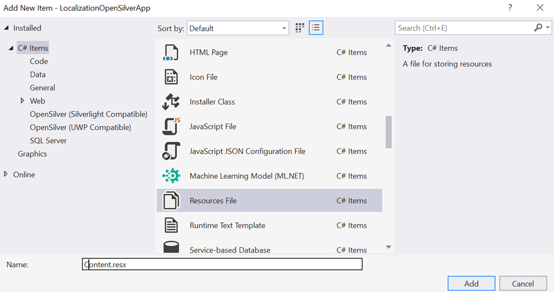

1. Double-click the newly created Resources file to edit it in Visual Studio. Add localizable strings to the file<br/>
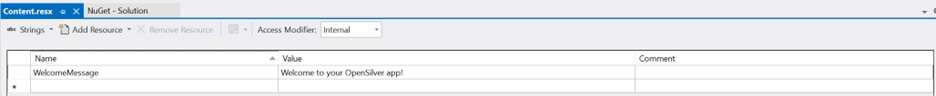

1. Add any number of additional Resources files, one for each of the desired languages. For example, we add a new one for Brazilian Portuguese:<br/>
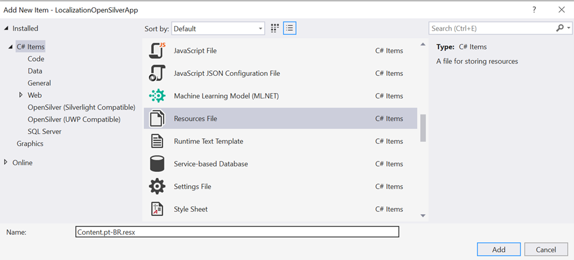

1. For each new Resources file, add the corresponding localized strings, keeping the same `Name` fields across all `.resx` files:<br/>
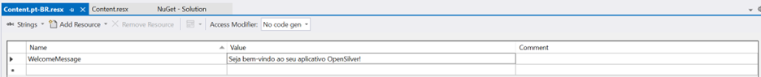

1. Make sure that all Resources files are marked with Build Action as Embedded Resource:<br/>
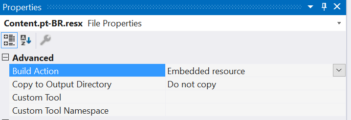

1. Add the `Microsoft.Extensions.Localization` NuGet package to the .Browser project:<br/>
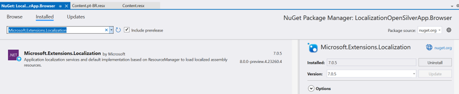

1. Set the `BlazorWebAssemblyLoadAllGlobalizationData` flag to `true` on the `.Browser` `.csproj` file:<br/>
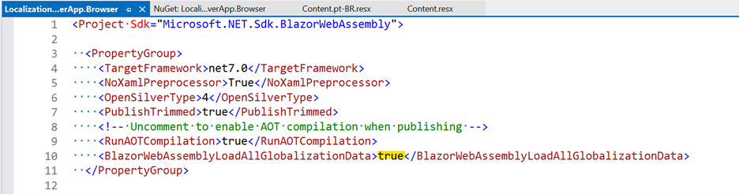

1. Add `builder.Services.AddLocalization()` to the `Main` method in `Program.cs` on the `.Browser` project:<br/>
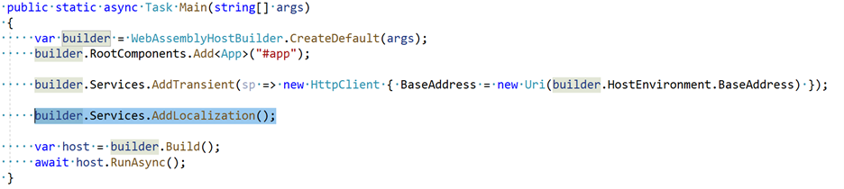

1. Go to the `MainPage.xaml` file in the class project (or any other file that you would like to place the messages) and have a control that can display the contents, for example:<br/>
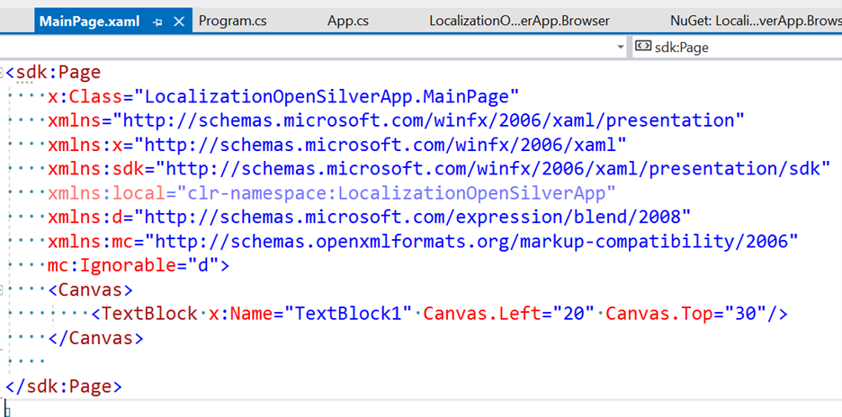

1. In the code-behind (or via `Binding`), get localized strings from the `.resx` files by calling their generated code:<br/>
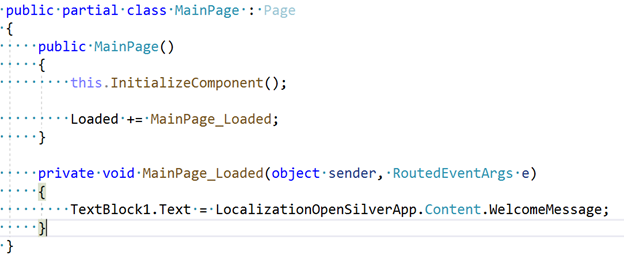

1. Run the app. Contents will be based on the language set for the browser. If set to English, the content will be obtained from the `Content.resx` file (because there is no specific `Content.en-US.resx` file available):<br/>
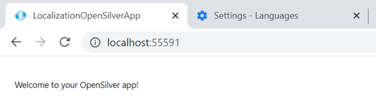

1. By changing the browser language to Brazilian Portuguese and refreshing the page, we can see the updated message (that was obtained from `Content.pt-BR.resx`):<br/>
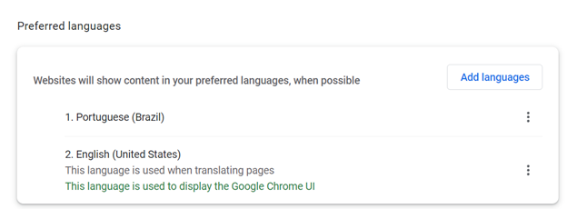<br/>
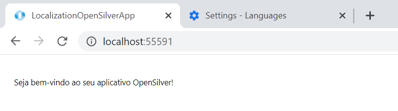

## Parameterize the culture

So far, contents were localized based on the default browser language. In order to make the language parameterized, follow these steps:

1. In the `wwwroot/index.html` file in the `.Browser` project, add a JS property that can store the selected culture using localStorage, for example:</br>
```JS
<script>
  window.selectedCultureName = {
    get: () => window.localStorage['selectedCultureName'],
    set: (value) => window.localStorage['selectedCultureName'] = value
  };
</script>
```
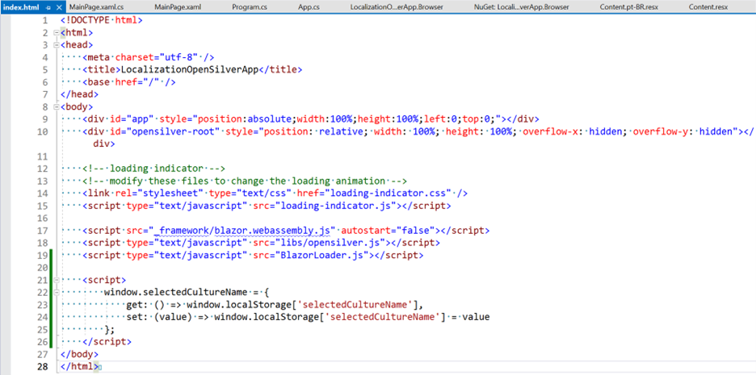

2. In `Program.cs`, add the following code before `host.RunAsync()` is executed:
```C#
CultureInfo culture;
var js = host.Services.GetRequiredService<IJSRuntime>();
var result = await js.InvokeAsync<string>("selectedCultureName.get");

if (result != null)
{
    culture = new CultureInfo(result);
}
else
{
    culture = new CultureInfo("en-US");
    await js.InvokeVoidAsync("selectedCultureName.set", "en-US");
}

CultureInfo.DefaultThreadCurrentCulture = culture;
CultureInfo.DefaultThreadCurrentUICulture = culture;
```
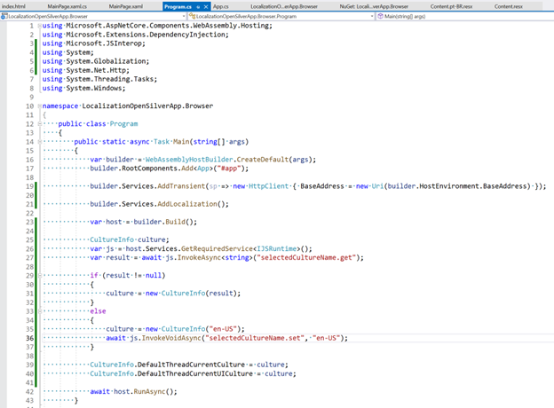

3. On `MainPage.xaml`, add a control to select the possible cultures:<br/>
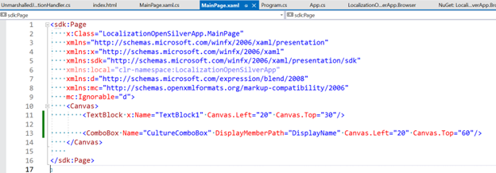

4. Then add code to update the localStorage value and refresh the page:
```C#
namespace LocalizationOpenSilverApp
{
    public partial class MainPage : Page
    {
        public MainPage()
        {
            this.InitializeComponent();

            Loaded += MainPage_Loaded;
        }

        private void MainPage_Loaded(object sender, RoutedEventArgs e)
        {
            TextBlock1.Text = LocalizationOpenSilverApp.Content.WelcomeMessage;

            CultureComboBox.ItemsSource = new List<CultureInfo>
            {
                new CultureInfo("en-US"),
                new CultureInfo("pt-BR")
            };
            if (CultureComboBox.Items.Contains(CultureInfo.DefaultThreadCurrentCulture))
            {
                CultureComboBox.SelectedItem = CultureInfo.DefaultThreadCurrentCulture;
            }
            CultureComboBox.SelectionChanged += CultureComboBox_SelectionChanged;
        }

        private void CultureComboBox_SelectionChanged(object sender, SelectionChangedEventArgs e)
        {
            OpenSilver.Interop.ExecuteJavaScriptVoid("window.selectedCultureName.set($0)", (e.AddedItems[0] as CultureInfo).Name);

            OpenSilver.Interop.ExecuteJavaScriptVoid("location.reload()");
        }
    }
}
```
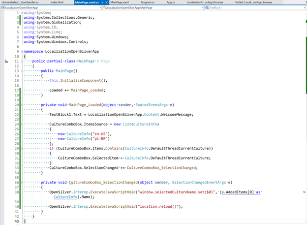

5. Now it is possible to select the desired language:<br/>
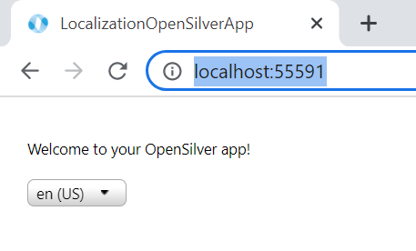<br/>
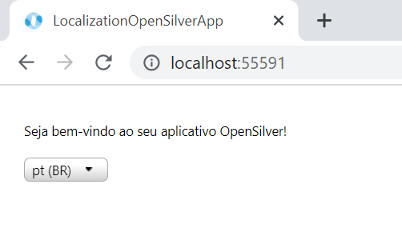
