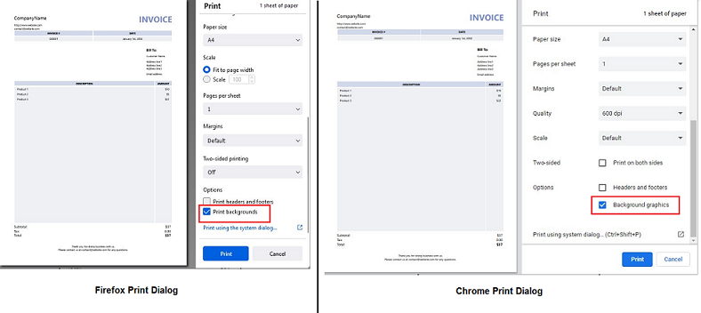

# Printing with OpenSilver

## Introduction
OpenSilver provides a "PrintManager" class that lets you print from within your app.

You can print either the whole window or a specific UI Element of your app.

Here is a an example:
```
var textToPrint = new TextBlock() { Text = "This is some text to print." };

CSHTML5.Native.Html.Printing.PrintManager.Print(textToPrint);
```

You can also set a "Print Area", so that when the user presses "Ctrl+P" or clicks on "File" -> "Print" in the browser, the content of the "Print Area" is printed instead of the whole window.

*Note:* In Firefox and IE, in order to print background colors and images (including Image and Path elements), the user needs to explicitly check the option *"Print Background (Colors and Images) or Background Graphics*" from the Options section of the Print dialog. Otherwise only text and foregrounds will be printed.


## Methods of the PrintManager static class:

* *Print():* Call this method to make the browser Print dialog appear.

Note: by default, the whole content of the window is printed. However, this behavior can be changed by using the "SetPrintArea" method below, or by using the other "Print(element)" overload.

This method runs synchronously.

* *Print(element):* Call this method to print a specific element in the UI.

Note: this method runs synchronously if the element is aready present in the Visual Tree, and it runs asynchronously if the element is not in the Visual Tree (such as an element that you have created on the fly in C#). To know whether an element is in the Visual Tree or not, you can read its property "IsLoaded". If you want, you can register the "element.Loaded" event to be notified when the element becomes present in the Visual Tree.

* *SetPrintArea(element):* Call this method to define the element that will be printed when pressing Ctrl+P or when clicking the Print command in the browser menu.

Note: the element must be in the Visual Tree. To know whether an element is in the Visual Tree or not, you can read its property "IsLoaded". If you want, you can register the "element.Loaded" event to be notified when the element becomes present in the Visual Tree.

* *ResetPrintArea():* Call this method to reset the print area to its default value. The print area is the area that will be printed when pressing Ctrl+P or when clicking the Print command in the browser menu. The default value is the whole content of the window.

## Note about colors, images, and shapes in FireFox and IE

In Firefox and IE, in order to print background colors and images (including Image and Path elements), the user needs to explicitly check the option *"Print Background (Colors and Images) or Background Graphics"* from the Options section of the Print dialog. Otherwise only text and foregrounds will be printed.




## Example: printing an invoice
Here is a screenshot of the result:


### XAML code:
```
<StackPanel Background="White">
    <TextBlock Text="INVOICE PRINTING EXAMPLE" Margin="5" HorizontalAlignment="Left"/>
    <Button Content="Click to print the invoice below" Click="ButtonPrint_Click" HorizontalAlignment="Left" Margin="5,0,0,20" Background="Red" Foreground="White" FontWeight="Bold"/>
    <Border Width="400" Height="600" BorderThickness="3" BorderBrush="Black">
        <Border x:Name="InvoiceToPrint" Background="White">
            <Grid Margin="15,10">
                <Grid.RowDefinitions>
                    <RowDefinition Height="Auto"/>
                    <RowDefinition Height="Auto"/>
                    <RowDefinition Height="Auto"/>
                    <RowDefinition Height="*"/>
                    <RowDefinition Height="Auto"/>
                    <RowDefinition Height="Auto"/>
                </Grid.RowDefinitions>
                <StackPanel Grid.Row="0" HorizontalAlignment="Left">
                    <TextBlock Text="CompanyName" FontSize="20" Margin="0,5,0,0"/>
                    <TextBlock Text="http://www.website.com" Margin="0,10,0,0"/>
                    <TextBlock Text="contact@website.com" Margin="0,0,0,0"/>
                </StackPanel>
                <TextBlock Grid.Row="0" Text="INVOICE" FontSize="35" FontWeight="Bold" HorizontalAlignment="Right" Foreground="#7A8DC5"/>
                <Grid Grid.Row="1" HorizontalAlignment="Right">
                    <Grid.RowDefinitions>
                        <RowDefinition Height="Auto"/>
                        <RowDefinition Height="Auto"/>
                        <RowDefinition Height="Auto"/>
                    </Grid.RowDefinitions>
                    <Grid.ColumnDefinitions>
                        <ColumnDefinition/>
                        <ColumnDefinition/>
                    </Grid.ColumnDefinitions>
                    <Border Grid.Row="0" Grid.Column="0" Background="#D2D9EB" Margin="2">
                        <TextBlock Text="INVOICE #" FontWeight="Bold" HorizontalAlignment="Center" VerticalAlignment="Center" Margin="10,3,10,3"/>
                    </Border>
                    <Border Grid.Row="0" Grid.Column="1" Background="#D2D9EB" Margin="2">
                        <TextBlock Text="DATE" FontWeight="Bold" HorizontalAlignment="Center" VerticalAlignment="Center" Margin="10,3,10,3"/>
                    </Border>
                    <Border Grid.Row="1" Grid.Column="0" Background="#EEF0F4" Margin="2">
                        <TextBlock Text="000001" HorizontalAlignment="Center" VerticalAlignment="Center" Margin="10,3,10,3"/>
                    </Border>
                    <Border Grid.Row="1" Grid.Column="1" Background="#EEF0F4" Margin="2">
                        <TextBlock Text="January 1st, 2050" HorizontalAlignment="Center" VerticalAlignment="Center" Margin="10,3,10,3"/>
                    </Border>
                </Grid>
                <StackPanel Grid.Row="2" HorizontalAlignment="Right" Margin="0,20,30,0">
                    <TextBlock Text="Bill To:" FontSize="14" FontWeight="Bold" Margin="0,5,0,0"/>
                    <TextBlock Text="Customer Name" Margin="0,10,0,0"/>
                    <TextBlock Text="Address line1" Margin="0,8,0,0"/>
                    <TextBlock Text="Address line2" Margin="0,0,0,0"/>
                    <TextBlock Text="Address line3" Margin="0,0,0,0"/>
                    <TextBlock Text="Email address" Margin="0,8,0,0"/>
                </StackPanel>
                <Grid Grid.Row="3" Margin="0,20,0,0">
                    <Grid.RowDefinitions>
                        <RowDefinition Height="Auto"/>
                        <RowDefinition Height="*"/>
                    </Grid.RowDefinitions>
                    <Grid.ColumnDefinitions>
                        <ColumnDefinition Width="*"/>
                        <ColumnDefinition Width="Auto"/>
                    </Grid.ColumnDefinitions>
                    <Border Grid.Row="0" Grid.Column="0" Background="#D2D9EB" Margin="2">
                        <TextBlock Text="DESCRIPTION" FontWeight="Bold" HorizontalAlignment="Center" VerticalAlignment="Center" Margin="10,3,10,3"/>
                    </Border>
                    <Border Grid.Row="0" Grid.Column="1" Background="#D2D9EB" Margin="2">
                        <TextBlock Text="AMOUNT" FontWeight="Bold" HorizontalAlignment="Center" VerticalAlignment="Center" Margin="10,3,10,3"/>
                    </Border>
                    <Border Grid.Row="1" Grid.Column="0" Background="#EEF0F4" Margin="2">
                        <StackPanel>
                            <TextBlock Text="Product 1" Margin="10,3,10,3"/>
                            <TextBlock Text="Product 2" Margin="10,3,10,3"/>
                            <TextBlock Text="Product 3" Margin="10,3,10,3"/>
                        </StackPanel>
                    </Border>
                    <Border Grid.Row="1" Grid.Column="1" Background="#EEF0F4" Margin="2">
                        <StackPanel>
                            <TextBlock Text="$10" Margin="10,3,10,3" HorizontalAlignment="Right"/>
                            <TextBlock Text="$5" Margin="10,3,10,3" HorizontalAlignment="Right"/>
                            <TextBlock Text="$22" Margin="10,3,10,3" HorizontalAlignment="Right"/>
                        </StackPanel>
                    </Border>
                </Grid>
                <Grid Grid.Row="4" HorizontalAlignment="Right" Margin="0,5,5,0">
                    <Grid.RowDefinitions>
                        <RowDefinition Height="Auto"/>
                        <RowDefinition Height="Auto"/>
                        <RowDefinition Height="Auto"/>
                    </Grid.RowDefinitions>
                    <Grid.ColumnDefinitions>
                        <ColumnDefinition/>
                        <ColumnDefinition/>
                    </Grid.ColumnDefinitions>
                    <TextBlock Grid.Row="0" Grid.Column="0" Text="Subtotal:" FontSize="14"/>
                    <TextBlock Grid.Row="0" Grid.Column="1" Text="$37" Margin="20,0,0,0" FontSize="14" HorizontalAlignment="Right"/>
                    <TextBlock Grid.Row="1" Grid.Column="0" Text="Tax:" FontSize="14"/>
                    <TextBlock Grid.Row="1" Grid.Column="1" Text="0.00" Margin="20,0,0,0" FontSize="14" HorizontalAlignment="Right"/>
                    <TextBlock Grid.Row="2" Grid.Column="0" Text="Total:" FontSize="14"/>
                    <TextBlock Grid.Row="2" Grid.Column="1" Text="$37" Margin="20,0,0,0" FontSize="14" FontWeight="Bold" HorizontalAlignment="Right"/>
                </Grid>
                <StackPanel Grid.Row="5" Margin="0,30,0,0">
                    <TextBlock Text="Thank you for doing business with us." TextAlignment="Center"/>
                    <TextBlock Text="Please contact us at contact@website.com for any questions." TextAlignment="Center"/>
                </StackPanel>
            </Grid>
        </Border>
    </Border>
</StackPanel>
 ```

### C# code:
```
private void ButtonPrint_Click(object sender, RoutedEventArgs e)
{
    CSHTML5.Native.Html.Printing.PrintManager.Print(InvoiceToPrint);
}
```
## Contact Us
Please [click here](https://opensilver.net/contact.aspx) for contact information.
